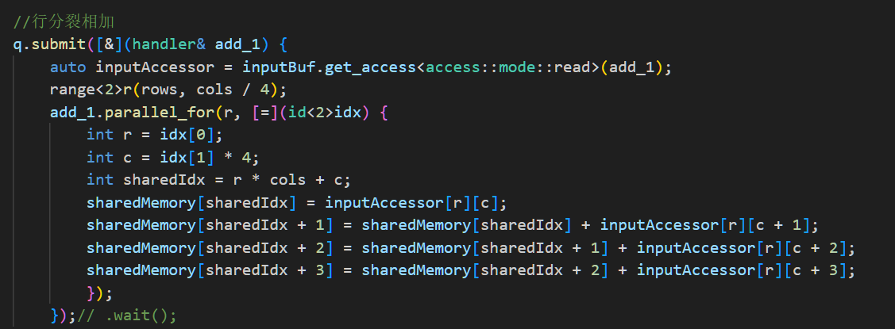

# Wave filtering

滤波是将信号中特定波段频率滤除的操作，是抑制和防止干扰的一项重要措施。是根据观察某一随机过程的结果，对另一与之有关的随机过程进行**估计**的概率理论与方法。

## 均值滤波

均值滤波是典型的线性滤波算法，它是指在图像上对目标像素给一个模板，该模板包括了其周围的临近像素，再用模板中的全体像素的平均值来代替原来像素值。

类似于一个全为1的矩阵，对图像进行卷积。

## 高斯滤波
高斯滤波是一种线性平滑滤波，适用于消除**高斯噪声**，广泛应用于图像处理的减噪过程。 通俗的讲，高斯滤波就是对整幅图像进行加权平均的过程，每一个像素点的值，都由其本身和邻域内的其他像素值经过加权平均后得到。

高斯滤波的具体操作是：用**卷积**扫描图像中的每一个像素，用模板确定的邻域内像素的**加权平均**灰度值去替代模板中心像素点的值。

图像大多数噪声均属于高斯噪声，因此高斯滤波器应用也较广泛。

高斯滤波的卷积矩阵权值符合**正态分布**，也称**高斯分布**。

# 高斯滤波优化

## 为什么？

在传统的CPU程序中，我们通常使用**双层for循环**来实现对图像每一个像素的卷积。

而通过并行计算，我们可以实现对各个像素点的同时计算。

## 效果如何？

下图是：处理1280x720分辨率的图片，耗时随卷积矩阵大小改变的趋势。

可以看出，通过并行计算，在处理**更大数据量**的情况下，获得更加优异且显著的效果。

下图是：采用257*257卷积处理图片，耗时随图片大小的改变趋势。

可以看出，通过并行计算，在处理**更大图片尺寸**的情况下，获得更加优异且显著的效果。

# 均值滤波优化

## 殊途同归？

同样的，我们对均值滤波进行并行计算。

## 进一步优化

但是获得的效率的提升并不显著。

因为在对每一个像素点的卷积中，我们反复的去求区域和，这是主要我算法受限制的点。

由此我们引入**积分图优化**，并通过并行计算进行实现。

> **积分图**（英语：**integral image**），又称总和面积表（英语：**summed area table**，简称**SAT**）[[1\]](https://zh.wikipedia.org/wiki/积分图#cite_note-1)，是一个快速且有效的对一个网格的矩形子区域中计算和的数据结构和算法。
>
> 来自维基百科

### 实现积分图优化算法：

为了以下几个步骤

1.行分裂相加

2.行块末尾求值

3.行块内部求值

4.列分块相加

5.列块末尾求值

6.列块内部求值

## 效果如何？

我们可以发现：随着图像尺寸增长，积分图优化的均值滤波依旧保持几乎不变的运行时间。

同样的，我们发现随着卷积大小的增长，积分图优化的均值滤波依旧保持几乎不变的运行时间

# SYCL

* 设备选择器

  使device具有多样化，使oneAPI的精髓

  

  

* 任务队列

  host与device的交互载体

  

  

* 数据缓冲区

  实现host到device的数据传输

  

* 数据访问器

  设置device对数据的访问权限

  

* 共享内存

  使用**malloc_shared**申请，可以在作用范围内共享访问。

  

  在本项目中，共享内存在积分图的实现上起到重要作用。

# 数据来源

* 本报告中的图借助matplotlib绘制

  

* 分析数据来源

  使用clock函数进行计时

  

* 生成数据表格

  